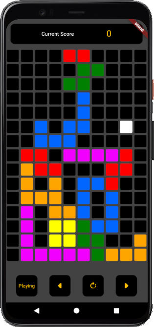
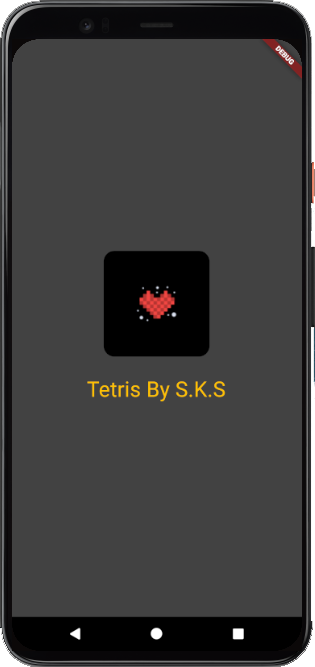

# Flutter Tetris Game 🎮🧩

Experience the classic fun of Tetris in a modern and vibrant way with this Flutter and Dart-based Tetris game.

## Features

- Intuitive touch controls: Swipe and tap to move, rotate, and drop tetrominoes effortlessly.
- Smooth animations: Enjoy fluid movement and responsive interactions for an immersive gaming experience.
- Progressive difficulty: Challenge yourself as the game speeds up over time, testing your reflexes and decision-making skills.
- High-score tracking: Compete with yourself and friends as you strive to reach new high scores.
- Visually appealing: Feast your eyes on colorful visuals and engaging graphics while playing.

## How to Play

- Swipe left or right to move tetrominoes horizontally.
- Swipe downward to accelerate the falling speed of tetrominoes.
- Tap to rotate tetrominoes and fit them into the desired positions.
- Complete full lines horizontally to clear them and earn points.
- The game ends if tetrominoes stack up to the top of the screen.

## Getting Started

1. Clone this repository.
2. Make sure you have Flutter and Dart installed.
3. Run `flutter pub get` to install dependencies.
4. Connect a device or emulator.
5. Run `flutter run` to start the game.

## Screenshots

## Contributions

Contributions are welcome! If you find any issues or want to add new features, feel free to open a pull request.

## License

This project is licensed under the [MIT License](LICENSE).

Enjoy the timeless challenge of Tetris reimagined with the power of Flutter and Dart! Get ready to sharpen your spatial skills and have hours of fun. Let the blocks fall!
